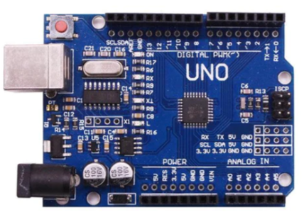
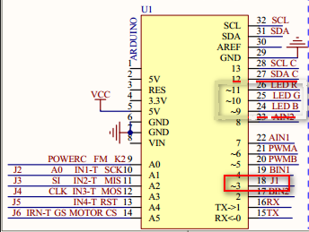
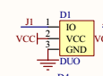
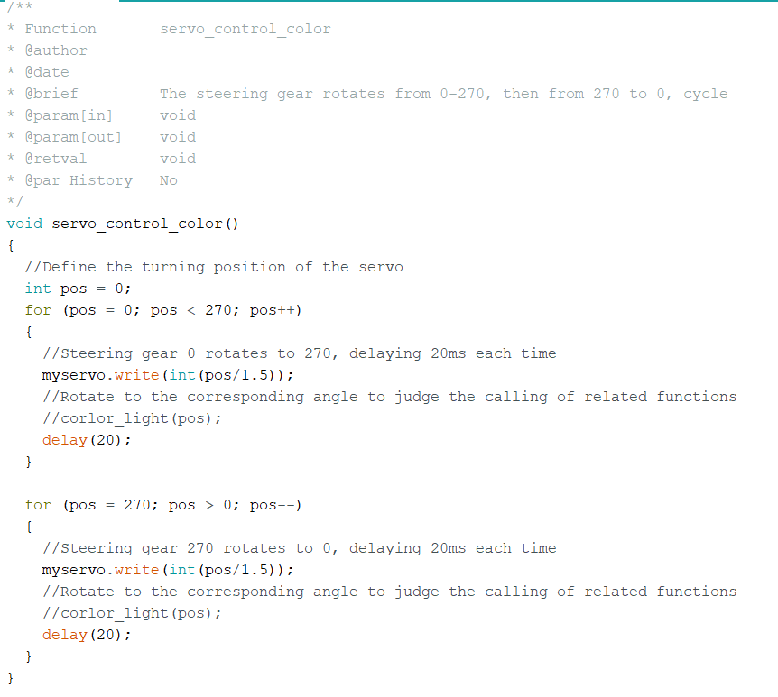

# Using of 270° Servo --- Ardiuno

## 1.Preparation
*** arduino board ***

*** 270° servo ***

*** 7.4V battery ***

## 2.Purpose
After the Arduino micro-controller is powered on, it will delay for 0.5s first, and then the steering gear starts to rotate from 0°-270°, so as to cycle.

## 3.Principle
The working principle of the servo: the control signal enters the signal modulation chip from the channel of the receiver to obtain the bias voltage of the DC. It has a reference circuit inside, which generates a reference signal with a period of 20ms and a width of 1.5ms. It will compares the DC bias voltage with the voltage of the potentiometer to obtain a voltage difference and output. The positive and negative  of the voltage difference is outputted to the motor drive chip to determine the forward and reverse of the motor.

Servo rotation angle is by adjusting the duty ratios of PWM (pulse width modulation) signal. The standard PWM (pulse width modulation) signal has a fixed period of 20ms (50Hz). Theoretically, pulse width distribution should be between 1 ms to 2 ms, but in fact between pulse width can be 0.5 ms and 2.5 ms. Pulse width and the servo rotation angle 0°～180° corresponds, as shown below.

​       0.5ms-----------------0°

​       1.0ms-----------------45°

​       1.5ms-----------------90°

​       2.0ms-----------------135°

​       2.5ms-----------------180°

## 4.Steps
### 4.1 Schematic diagram
*** Arduino board ***

*** servo ***

### 4.2 Wiring
The 270° steering gear should be connected to the steering gear interface J1,
Arduino requires 5V power supply.
The positive pole (red wire) of steering gear shall be connected to the positive pole of 7.4V battery
The negative pole (black wire) of steering gear shall be connected to the negative pole of 7.4v battery
If there is no 7.4v battery or Arduino does not use 5V power supply, the steering gear will move around and be damaged.

## 5.Code
