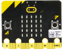
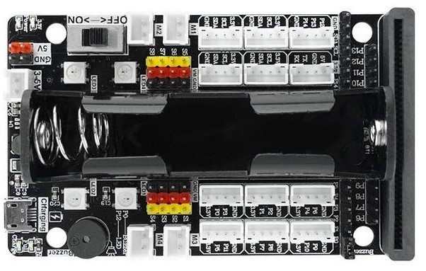

# Using of 270° Servo --- Microbit

## 1.Preparation
1. Microbit V2.0 board *1
   

2. supbit 2.0 expansion board *1
   

3. 270° servo *1
   

4.7.4V battery

## 2.Purpose
Control the 270° steering gear rotation (0° -50° -90° -0° ) , then keep cycle.

## 3.Principle
The working principle of the servo: the control signal enters the signal modulation chip from the  channel of the receiver to obtain the bias voltage of the DC. It has a reference circuit inside, which  generates a reference signal with a period of 20ms and a width of 1.5ms. It will compares the DC  bias voltage with the voltage of the potentiometer to obtain a voltage difference and output. The  positive and negative of the voltage difference is outputted to the motor drive chip to determine  the forward and reverse of the motor. Servo rotation angle is by adjusting the duty ratios of PWM (pulse width modulation) signal. The  standard PWM (pulse width modulation) signal has a fixed period of 20ms (50Hz). Theoretically,  pulse width distribution should be between 1 ms to 2 ms, but in fact between pulse width can be  0.5 ms and 2.5 ms. Pulse width and the servo rotation angle 0°～180° corresponds, as shown  below.

0.5ms-----------------0° 

1.0ms-----------------45° 

1.5ms-----------------90° 

2.0ms-----------------135° 

2.5ms-----------------180°

## 4.Wiring

Note: 

Microbit need to connect to super:bit expansion board. 

Positive pole of servo -- positive pole of 7.4V power supply
Negative pole of servo -- negative pole of 7.4V power supply

A GND pin on super:bit expansion board -- negative pole of 7.4V power supply

## 5.Code
