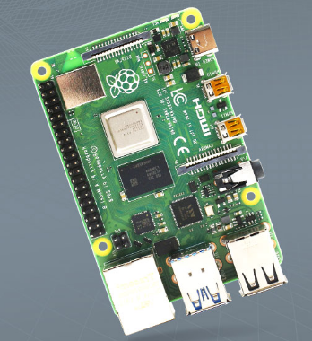
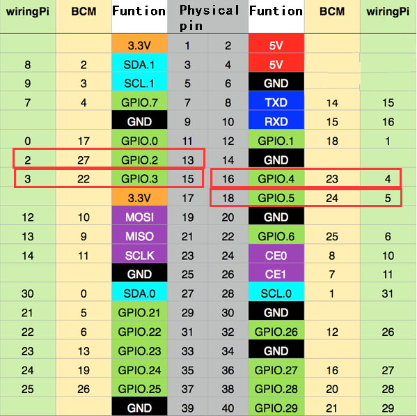
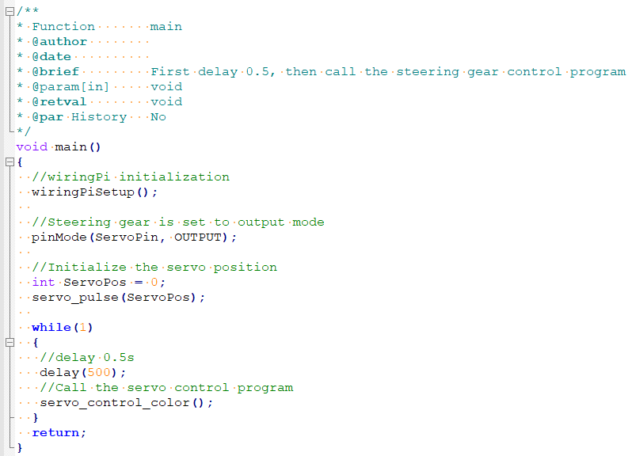

# Using of 270° Servo --- Raspberry Pi

## 1.Preparation
Raspberry Pi board *1


270° servo *1


7.4V battery *1

## 2.Purpose
After the Raspberry Pi is powered on, after a delay of 0.5 seconds, the steering gear starts to cycle from 0-270-0.

## 3.实验原理
The working principle of the servo: the control signal enters the signal modulation chip from the  channel of the receiver to obtain the bias voltage of the DC. It has a reference circuit inside, which  generates a reference signal with a period of 20ms and a width of 1.5ms. It will compares the DC  bias voltage with the voltage of the potentiometer to obtain a voltage difference and output. The  positive and negative of the voltage difference is outputted to the motor drive chip to determine  the forward and reverse of the motor. Servo rotation angle is by adjusting the duty ratios of PWM  (pulse width modulation) signal. The standard PWM (pulse width modulation) signal has a fixed  period of 20ms (50Hz). Theoretically, pulse width distribution should be between 1 ms to 2 ms,  but in fact between pulse width can be 0.5 ms and 2.5 ms. Pulse width and the servo rotation  angle 0°～180° corresponds, as shown below. 

0.5ms-----------------0°  

1.0ms-----------------45°  

1.5ms-----------------90°  

2.0ms-----------------135°  

2.5ms-----------------180°

## 4.Steps
### 4.1 Schematic diagram


### 4.2 Wiring
1. The red wire (positive pole) of the servo is connected to the positive pole of the 7.4V battery
2. The brown wire (negative pole) of the servo is connected to the negative pole of the 7.4V battery
3. The yellow wire (signal wire) of the servo is connected to the physical pin (8-pin) of the raspberry pie motherboard, GPIO4
4. The Raspberry Pi board is powered by the computer, and any GND interface on the board is connected to the negative pole of the battery

### 4.3 Code
Input following command
```shell
gcc ServoControlCorlor.c -o ServoControlCorlor -lwiringPi -lpthread #Compile command

./ServoControlCorlor  #Execute command
```

## 5.Code
